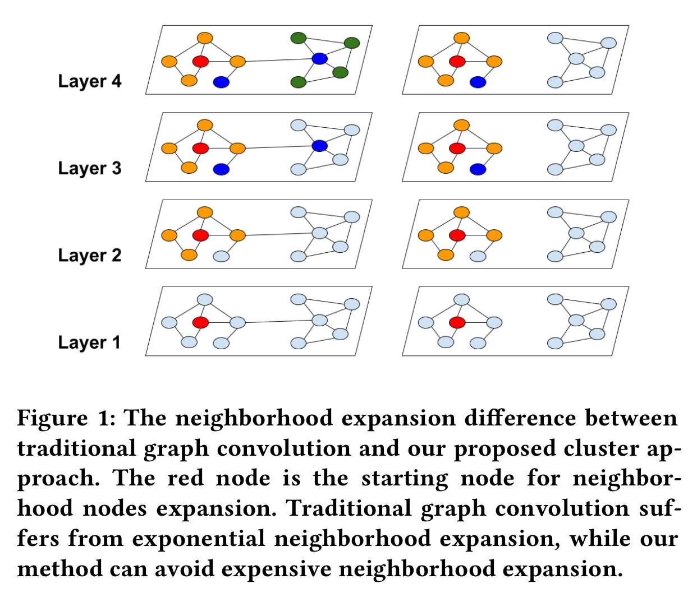
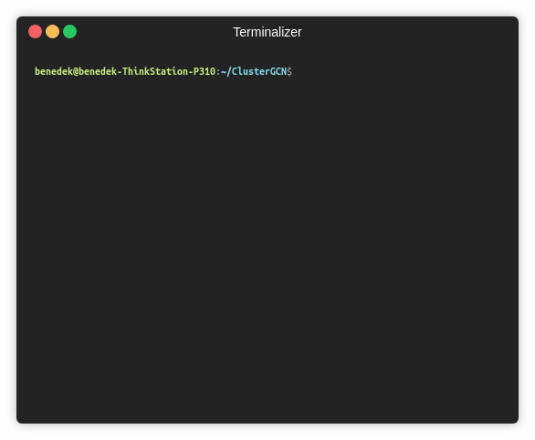

ClusterGCN
========
[](https://arxiv.org/abs/1905.07953) [](https://codebeat.co/projects/github-com-benedekrozemberczki-clustergcn-master)
 [](https://github.com/benedekrozemberczki/ClusterGCN/archive/master.zip) [](https://twitter.com/intent/follow?screen_name=benrozemberczki)

A PyTorch implementation of "Cluster-GCN: An Efficient Algorithm for Training Deep and Large Graph Convolutional Networks" (KDD 2019).
<p align="center">
  
</p>

### Abstract

<p align="justify">
Graph convolutional network (GCN) has been successfully applied to many graph-based applications; however, training a large-scale GCN remains challenging. Current SGD-based algorithms suffer from either a high computational cost that exponentially grows with number of GCN layers, or a large space requirement for keeping the entire graph and the embedding of each node in memory. In this paper, we propose Cluster-GCN, a novel GCN algorithm that is suitable for SGD-based training by exploiting the graph clustering structure. Cluster-GCN works as the following: at each step, it samples a block of nodes that associate with a dense subgraph identified by a graph clustering algorithm, and restricts the neighborhood search within this subgraph. This simple but effective strategy leads to significantly improved memory and computational efficiency while being able to achieve comparable test accuracy with previous algorithms. To test the scalability of our algorithm, we create a new Amazon2M data with 2 million nodes and 61 million edges which is more than 5 times larger than the previous largest publicly available dataset (Reddit). For training a 3-layer GCN on this data, Cluster-GCN is faster than the previous state-of-the-art VR-GCN (1523 seconds vs 1961 seconds) and using much less memory (2.2GB vs 11.2GB). Furthermore, for training 4 layer GCN on this data, our algorithm can finish in around 36 minutes while all the existing GCN training algorithms fail to train due to the out-of-memory issue. Furthermore, Cluster-GCN allows us to train much deeper GCN without much time and memory overhead, which leads to improved prediction accuracy -- using a 5-layer Cluster-GCN, we achieve state-of-the-art test F1 score 99.36 on the PPI dataset, while the previous best result was 98.71.</p>

This repository provides a PyTorch implementation of ClusterGCN as described in the paper:

> Cluster-GCN: An Efficient Algorithm for Training Deep and Large Graph Convolutional Networks
> Wei-Lin Chiang, Xuanqing Liu, Si Si, Yang Li, Samy Bengio, Cho-Jui Hsieh.
> KDD, 2019.
> [[Paper]](https://arxiv.org/abs/1905.07953)

### Requirements
The codebase is implemented in Python 3.5.2. package versions used for development are just below.
```
networkx           1.11
tqdm               4.28.1
numpy              1.15.4
pandas             0.23.4
texttable          1.5.0
scipy              1.1.0
argparse           1.1.0
torch              0.4.1
torch-geometric    0.3.1
metis              0.2a.4
scikit-learn       0.20
torch_spline_conv  1.0.4
torch_sparse       0.2.2
torch_scatter      1.0.4
torch_cluster      1.1.5
```

Installing metis on Ubuntu:

```
sudo apt-get install libmetis-dev
```
### Datasets
<p align="justify">
The code takes the **edge list** of the graph in a csv file. Every row indicates an edge between two nodes separated by a comma. The first row is a header. Nodes should be indexed starting with 0. A sample graph for `Pubmed` is included in the  `input/` directory. In addition to the edgelist there is a csv file with the sparse features and another one with the target variable.</p>
<p align="justify">
The **feature matrix** is a sparse one and it is stored as a csv. Features are indexed from 0 consecutively. The feature matrix csv is structured as:</p>

| **NODE ID**|**FEATURE ID**|**Value** |
| --- | --- |---|
| 0 | 3 |0.2|
| 0 | 7 | 0.5 |
| 1 | 17 | 0.8 |
| 1 | 4 | 5.4 |
| 1 | 38 | 1.3 |
| ... | ... |...|
| n | 3 | 0.9 |
<p align="justify">
The **target vector** is a csv with two columns and headers, the first contains the node identifiers the second the targets. This csv is sorted by node identifiers and the target column contains the class meberships indexed from zero.</p>

| **NODE ID**|**Target** |
| --- | --- |
| 0 | 3 |
| 1 | 1 |
| 2 | 0 |
| 3 | 1 |
| ... | ... |
| n | 3 |

### Options
<p align="justify">
The training of a ClusterGCN model is handled by the `src/main.py` script which provides the following command line arguments.</p>

#### Input and output options
```
  --edge-path       STR    Edge list csv.         Default is `input/edges.csv`.
  --features-path   STR    Features csv.         Default is `input/features.csv`.
  --target-path     STR    Target classes csv.    Default is `input/target.csv`.
```
#### Model options
```
  --clustering-method   STR     Clustering method.             Default is `metis`.
  --cluster-number      INT     Number of clusters.            Default is 10. 
  --seed                INT     Random seed.                   Default is 42.
  --epochs              INT     Number of training epochs.     Default is 200.
  --test-ratio          FLOAT   Training set ratio.            Default is 0.9.
  --learning-rate       FLOAT   Adam learning rate.            Default is 0.01.
  --dropout             FLOAT   Dropout rate value.            Default is 0.5.
  --layers              LST     Layer sizes.                   Default is [16, 16, 16]. 
```
### Examples
<p align="justify">
The following commands learn a neural network and score on the test set. Training a model on the default dataset.</p>

```sh
$ python src/main.py
```
<p align="center">

</p>

Training a ClusterGCN model for a 100 epochs.
```sh
$ python src/main.py --epochs 100
```
Increasing the learning rate and the dropout.
```sh
$ python src/main.py --learning-rate 0.1 --dropout 0.9
```
Training a model with a different layer structure:
```sh
$ python src/main.py --layers 64 64
```
Training a random clustered model:
```sh
$ python src/main.py --clustering-method random
```


----------------------

**License**

- [GNU](https://github.com/benedekrozemberczki/ClusterGCN/blob/master/LICENSE)
